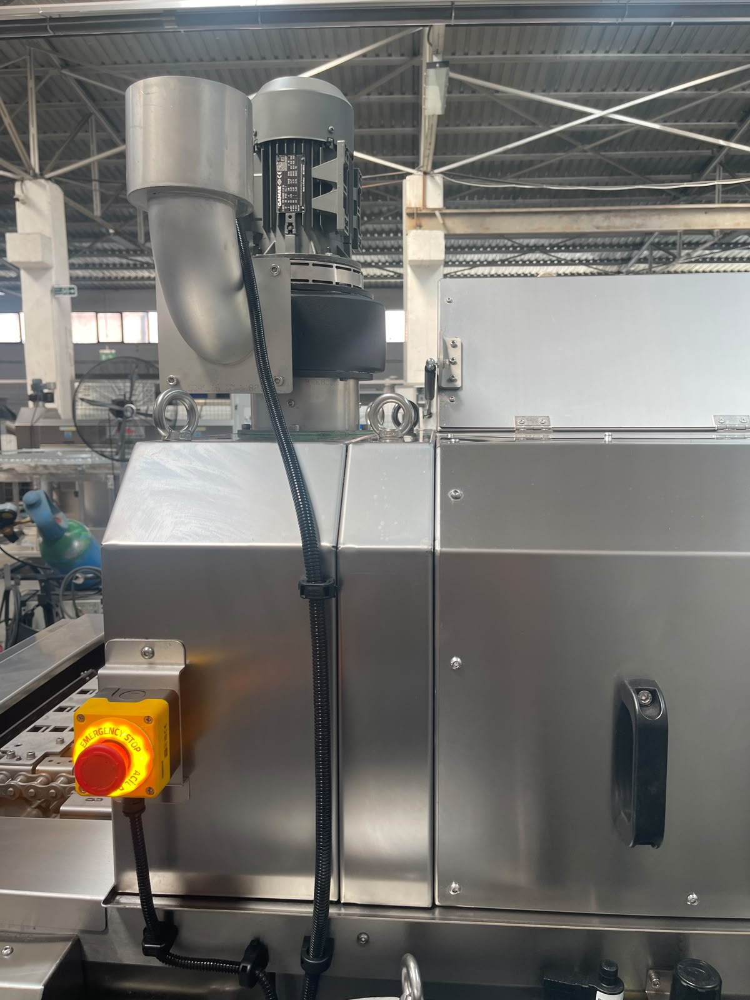

# 12. DEMONTAGE

Vor Demontage Maschine anhalten, Tanks entleeren und **LOTO** anwenden (siehe **9.1.2**, **10.1.2**).

| Parameter | Wert |
|-----------|------|
| Gefahrstoffe | Keine |
| Entsorgung | Umweltvorschriften im Einsatzland |

---

## Abschnittsinhalt

| Abschnitt | Titel | Thema |
|-----------|-------|-------|
| **12.1** | Demontage | Voraussetzungen, LOTO, Reihenfolge, Entsorgung |
| **12.2** | Außerbetriebnahme | Dauerhaft / temporär |
| **12.3** | Verschrottung | Schrottbewertung, Recycling |

<!-- FOTO: Demontage Übersicht -->

