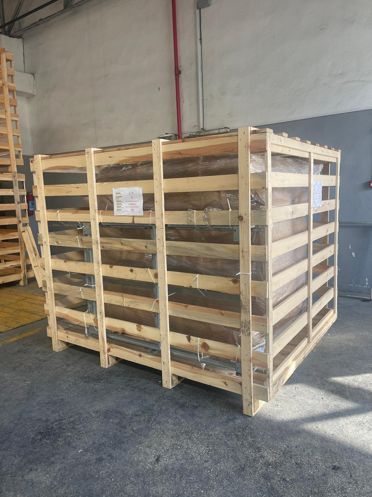
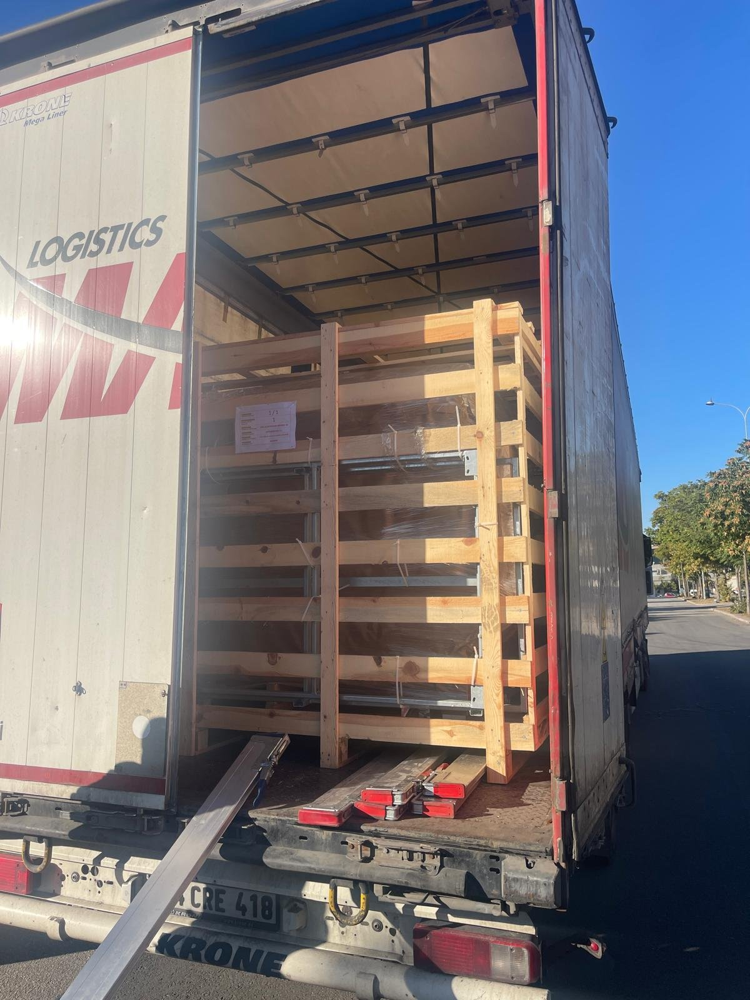

# 4.1 Ambalaj, kaldırma ve taşıma

Bu alt bölüm, makinenin sevkiyat ambalajını, teslim alma sırasında yapılacak kontrolleri ve makinenin forklift ile güvenli şekilde kaldırılıp kurulum yerine taşınmasını açıklar.

## 4.1.1 Ambalaj ve sevkiyat

Makine, sevkiyat yerine göre aşağıdaki ambalaj tiplerinden biriyle gönderilir:

| Sevkiyat | Ambalaj tipi | Koruma |
| :--- | :--- | :--- |
| **Yurt içi** | Yurt içi ambalajı | Darbe ve nem korumalı ambalaj |
| **Yurt dışı** | Ahşap sandık | Streç film ile sarılmış makine, ahşap sandık içinde |

Makinenin taşınması sırasında ortam sıcaklığı **+10 °C ile +50 °C** arasında olmalıdır. Makine üzerinde nakliye için takılan ve kurulum öncesinde sökülmesi gereken bir taşıma kilidi veya sabitleme elemanı bulunmaz. Ancak makine, nakliye aracında kaymaya ve devrilmeye karşı uygun bağlama elemanlarıyla araç kasasına sabitlenmelidir.

*Şekil 4.1 — Yurt dışı sevkiyat için ahşap sandık (solda) ve sandığın nakliye aracına yüklenmesi (sağda)*

Makinenin bir taşıma arabası ile birlikte sipariş edilmesi hâlinde taşıma arabası demonte olarak, makineyle birlikte gönderilir. Taşıma arabasının montajı **Bölüm 5.1**'de açıklanmıştır.

## 4.1.2 Teslim alma kontrolü

Makineyi teslim alırken, nakliye firmasının yetkilisi henüz tesisteyken aşağıdaki kontrolleri yapın:

1. Ambalajın dış yüzeyinde darbe, ezilme, yırtılma veya ıslanma izi olup olmadığını kontrol edin.
2. Ambalaj üzerindeki etiketin sipariş edilen model ve seri numarası ile uyuştuğunu doğrulayın.
3. Ambalajı açtıktan sonra makine gövdesini, kapağı, elektrik panosunu ve besleme kablosunu hasar açısından gözle kontrol edin.
4. Makineyle birlikte gönderilen dokümanların ve aksesuarların (taşıma arabası, yedek parçalar) eksiksiz olduğunu teslim belgesine göre kontrol edin.
5. Tespit edilen hasarı veya eksikliği, teslim belgesine yazılı olarak işletin ve fotoğrafla belgeleyin.
6. Hasar veya eksiklik durumunu derhal nakliye firmasına ve üreticiye yazılı olarak bildirin (**Bkz. Bölüm 1.3**).

Nakliye hasarı bulunan makineyi, üretici tarafından değerlendirilmeden çalıştırmayın.

## 4.1.3 Forklift ile kaldırma ve taşıma

Makinede forklift çatalları için ayrılmış özel çatal yuvası bulunmaz. Makine, çatallar doğrudan alt şase profillerinin altına sürülerek kaldırılır.

**Taşıma öncesi hazırlık**

1. Ana şalteri **0** konumuna getirin ve besleme fişini prizden çıkarın.
2. Yıkama tankındaki suyu tamamen boşaltın (**Bkz. Bölüm 10**). Tankında su bulunan makine hem daha ağırdır hem de suyun çalkalanması nedeniyle taşıma sırasında dengesini kaybedebilir.
3. Sepetteki parçaları ve gevşek aksesuarları çıkarın.
4. Üst kapağı kapatın.
5. Besleme kablosunu ve tahliye hortumlarını toplayın; zemine sarkmalarını ve çatallara takılmalarını önleyin.

**Kaldırma**

6. Forklift çatallarını, makinenin ağırlık merkezini ortalayacak şekilde alt şase profillerinin altına sürün. Çatalların makinenin karşı tarafından taşacak uzunlukta olduğunu doğrulayın.
7. Çatalların yalnızca şase profillerine temas ettiğini kontrol edin. Yan kaplama saclarına, tahliye vanasına, pompaya veya elektrik panosuna yük bindirmeyin.
8. Makineyi zeminden yaklaşık 10 cm kaldırın ve dengesini kontrol edin. Makine bir tarafa yatıyorsa yükü indirin ve çatalları yeniden konumlandırın.

**Taşıma ve indirme**

9. Makineyi zemine yakın (en fazla 20 cm yükseklikte) tutarak düşük hızda taşıyın. Ani fren ve keskin dönüşlerden kaçının.
10. Görüşün kısıtlı olduğu güzergâhlarda bir yönlendirici personel görevlendirin.
11. Makineyi, **Bölüm 3.5**'te tanımlanan gereksinimleri karşılayan kurulum yerine yavaşça indirin.
12. Dört ayağın da zemine tam olarak oturduğunu kontrol edin.

**DİKKAT — Gövde ve pano hasarı:** Kapak kollarından, kapaktan, elektrik panosundan veya borulardan tutularak yapılan çekme, itme ve kaldırma işlemleri gövdede kalıcı deformasyona ve elektrik bağlantılarında hasara yol açar. Makineyi yalnızca şaseden kaldırın ve taşıyın.
