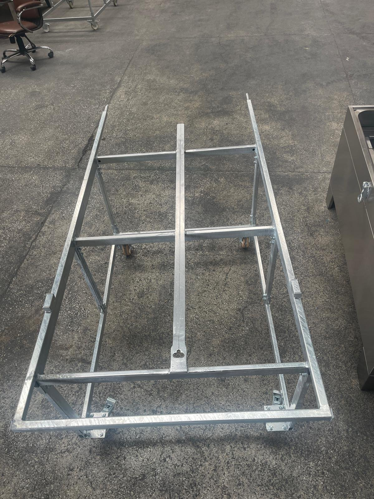
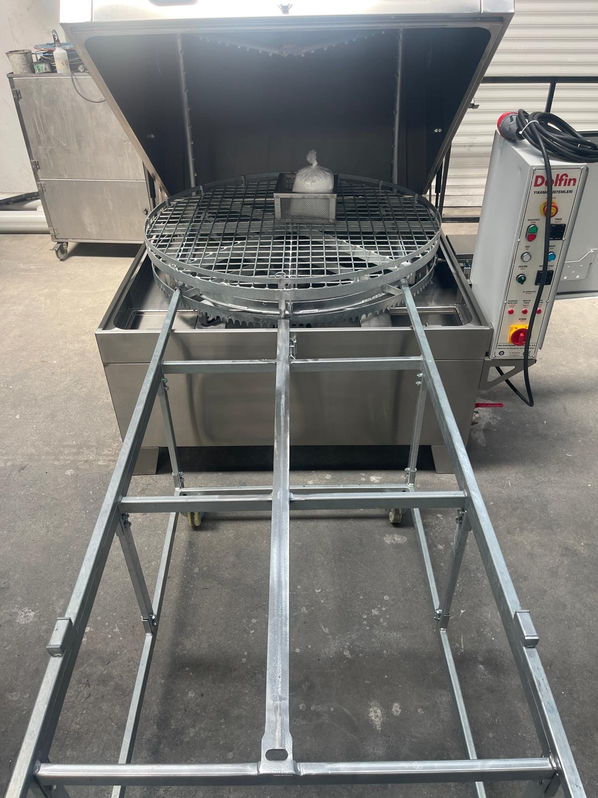

# 5.1 Makine ve taşıma arabası montajı

LYM serisi makineler, tüm bileşenleri takılmış ve fabrikada test edilmiş olarak tek parça hâlinde sevk edilir. Makinenin kendisi için kurulum yerinde herhangi bir mekanik montaj işlemi gerekmez.

## 5.1.1 Ambalajdan çıkarma

1. Ambalajı, makineyi forklift ile kurulum yerine yakın bir noktaya taşıdıktan sonra açın (**Bkz. Bölüm 4.1**).
2. Sandık veya ambalaj malzemesini, keskin aletleri makine yüzeyine temas ettirmeden sökün.
3. Makineyi saran streç filmi ve koruyucu malzemeleri çıkarın.
4. Kapağı açın; sepet üzerinde veya yıkama hücresi içinde gönderilen aksesuar ve yedek parça paketlerini çıkarın.
5. Ambalaj atıklarını yerel atık yönetmeliklerine göre ayrıştırarak bertaraf edin.

## 5.1.2 Taşıma arabasının montajı

Taşıma arabası, parçaların sepete makine dışında yüklenmesini ve yüklü sepetin makineye ray üzerinde sürülerek yerleştirilmesini sağlayan tekerlekli bir aparattır. Taşıma arabası modele bağlı bir aksesuardır; makineyle birlikte sipariş edilmesi hâlinde demonte olarak gönderilir ve kurulum sırasında monte edilmesi gerekir.

*Şekil 5.1 — Monte edilmiş taşıma arabası (solda) ve yükleme konumunda makine önüne yanaştırılmış araba (sağda)*

1. Taşıma arabasının parçalarını ambalajdan çıkarın ve teslim listesine göre eksiksiz olduğunu kontrol edin.
2. Arabayı, gönderilen montaj resmine göre monte edin. Montaj resmi bulunmuyorsa üreticiye başvurun (**Bkz. Bölüm 1.3**).
3. Bağlantı elemanlarını sıkın; tekerleklerin serbestçe döndüğünü kontrol edin.
4. Arabayı makinenin önüne yanaştırın; arabanın raylarının makinedeki sepet ray seviyesiyle hizalandığını ve araba ile makinenin birbirine tam oturduğunu kontrol edin.
5. Boş sepeti araba üzerinden makineye ve makineden arabaya sürerek hareketin takılmadan gerçekleştiğini doğrulayın.

Taşıma arabası montaj resmi ve tork değerleri: [EKSİK]
