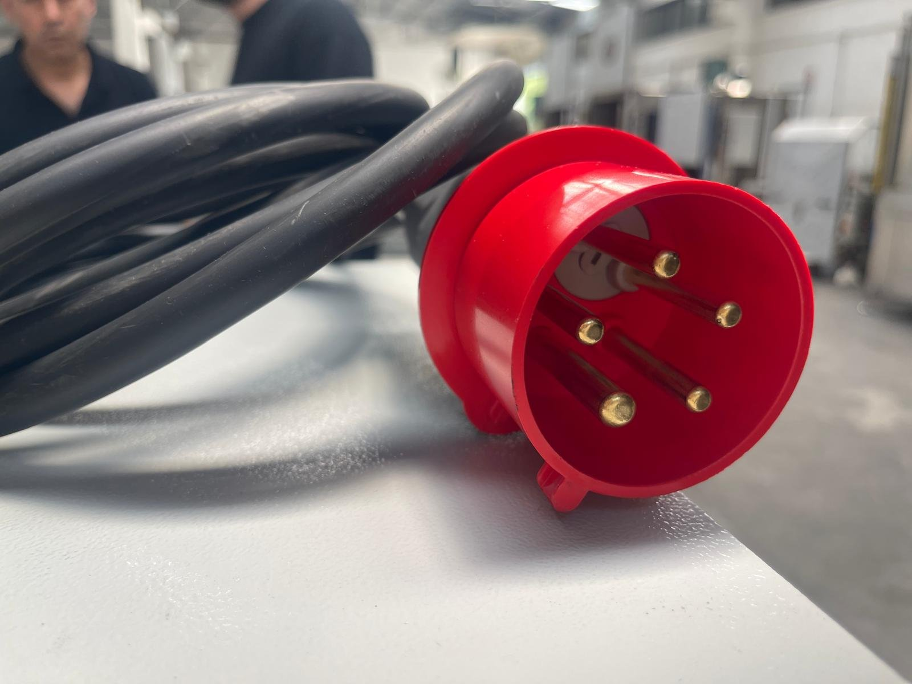
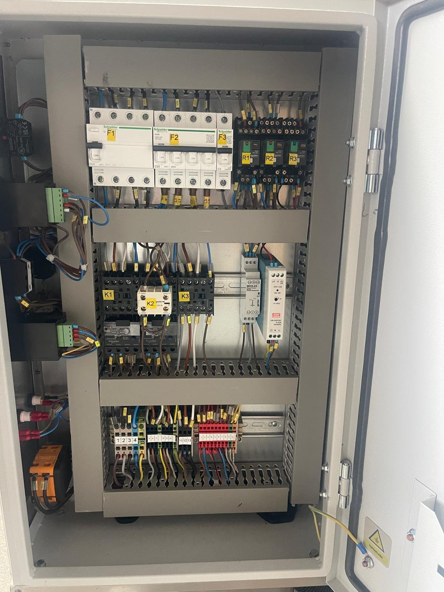

# 5.3 Elektrik, su ve tahliye bağlantıları

Bu alt bölüm, makinenin tesis elektrik şebekesine, su hattına ve atık su tahliye noktasına bağlanmasını açıklar. Makine basınçlı hava veya hidrolik besleme gerektirmez. Bağlantı değerleri **Bölüm 3.3.4** ve **Bölüm 3.3.5**'te verilmiştir.

## 5.3.1 Elektrik bağlantısı

Makine, 3 faz + nötr + koruma topraklaması (3P + N + PE) ile beslenir. LYM 950, LYM 1150 ve LYM 1350 modelleri, makineyle birlikte gönderilen 5 kutuplu 32 A endüstriyel fiş ve duvar prizi ile bağlanır.

*Şekil 5.2 — 5 kutuplu (3P + N + PE) endüstriyel besleme fişi*

**Tesis tarafı hazırlığı**

1. Tesis tarafında makineyi besleyecek hattı, **Bölüm 3.3.4**'te verilen besleme koruması değerine göre (LYM 950 / 1150 / 1350 için 25 A, LYM 1500 için 40 A) sigorta veya devre kesici ile koruyun.
2. Besleme kablosu kesitini, hat uzunluğuna ve yürürlükteki elektrik yönetmeliklerine göre yetkili elektrik personeline belirletin.
3. Makineyle birlikte gönderilen duvar prizini, makine besleme kablosunun gergin kalmadan ulaşabileceği bir noktaya monte edin ve tesis hattına bağlayın.
4. Koruma topraklaması iletkeninin (PE) prize bağlı ve tesis topraklama sistemiyle süreklilik içinde olduğunu ölçü aleti ile doğrulayın.

**Makinenin bağlanması**

5. Makinenin ana şalterinin **0** konumunda olduğunu kontrol edin.
6. Besleme kablosunu ezilme, kesilme ve sıcak yüzeylere temas riski olmayacak şekilde yönlendirin.
7. Besleme fişini prize takın.

LYM 1500 modelinin besleme bağlantı elemanı: [EKSİK]

**DİKKAT — Yanlış faz sırası:** Faz sırasının yanlış olması durumunda pano içindeki faz sıra rölesi makinenin çalışmasına izin vermez. Faz sırası kontrolü **Bölüm 5.5**'te açıklanmıştır. Faz sırası rölesini köprüleyerek makineyi çalıştırmayın; motorlar ters yönde dönerek pompa ve redüktörde hasara yol açabilir.

*Şekil 5.3 — Elektrik panosu iç görünüş: üst sırada kaçak akım koruma ve devre kesiciler, orta sırada kontaktörler ve termik röleler, alt sırada klemens bloğu*

## 5.3.2 Su bağlantısı ve ilk dolum

LYM 950 ve LYM 1150 modellerinde sabit su girişi bulunmaz; tank, kapak açıkken şebeke suyu ile elle doldurulur. LYM 1350 ve LYM 1500 modellerinde su girişi, tesis şebeke suyu hattına bağlanır.

**Su hattının bağlanması (LYM 1350 / 1500)**

1. Tesis su hattına, makineye en yakın noktada bir kesme vanası takın. Bu vana, bakım ve LOTO sırasında su beslemesinin kesilmesi için kullanılır.
2. Tesis hattı basıncını ölçün. Basınç 0,8 bar'ı aşıyorsa hatta basınç düşürücü takın.
3. Su hattını makinenin su giriş bağlantısına bağlayın; bağlantıda sızıntı olmadığını kontrol edin.

**İlk dolum**

4. Tahliye vanasının kapalı olduğunu kontrol edin.
5. Tankı, seviye bekçisinin düşük seviye sinyalini kaldıracağı seviyenin üzerine kadar şebeke suyu ile doldurun.
6. Yıkama kimyasalını, kimyasal üreticisinin belirttiği dozajda tanka ekleyin (**Bkz. Bölüm 3.2.2**).

Tankın azami dolum seviyesi ve seviye işareti: [EKSİK]

## 5.3.3 Atık su tahliye bağlantısı

Tank suyu, makinenin ön alt kısmındaki tahliye vanası ile boşaltılır. Tahliye çıkışı 1/2" bağlantıya sahiptir.

1. Tahliye vanasının çıkışına, atık suyu tesis atık su toplama noktasına ulaştıracak bir hortum veya boru bağlayın.
2. Tahliye hattını, suyun yerçekimi ile akabileceği şekilde sürekli eğimli olarak döşeyin.
3. Atık su toplama noktasının yağ ve kimyasal içeren proses suyunun yerel çevre mevzuatına uygun olarak bertaraf edilmesine izin verdiğini doğrulayın.

Drenaj pompası opsiyonu bulunan makinelerde tank suyu, drenaj pompası ile tahliye hattına basılır.
