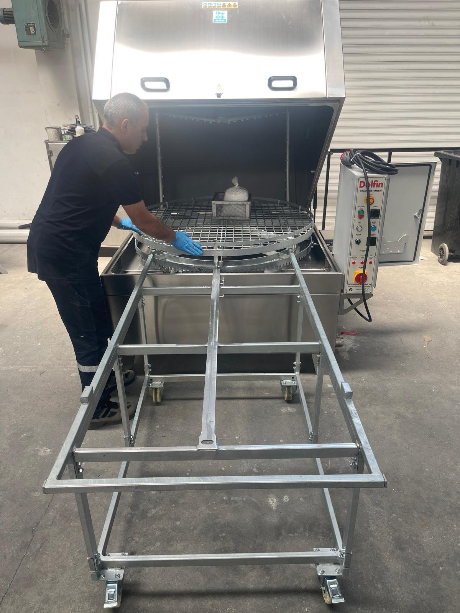

# 7.4 Yıkama çevrimi ve parça yükleme

Bu alt bölüm, parçaların sepete yüklenmesinden yıkanmış parçaların boşaltılmasına kadar bir yıkama çevriminin tamamını açıklar. Çevrime başlamadan önce makine **Bölüm 7.2**'ye göre devreye alınmış ve proses suyu hedef sıcaklığa ulaşmış olmalıdır.

## 7.4.1 Parçaların yüklenmesi

Parçalar, kapak açıkken sepete doğrudan yüklenir. Taşıma arabası bulunan makinelerde sepet, araba üzerine çekilerek makine dışında yüklenebilir ve yüklü olarak makineye geri sürülebilir.

*Şekil 7.1 — Taşıma arabası ile sepetin makine dışında yüklenmesi*

1. Kapağı tam olarak açın; amortisörlerin kapağı açık konumda tuttuğunu kontrol edin.
2. Gerekirse TEST butonuyla sepeti yükleme için uygun konuma döndürün; ardından butonu bırakın ve sepetin durduğunu kontrol edin.
3. Parçaları sepete, ağırlığı sepet üzerinde dengeli dağılacak şekilde yerleştirin. Ağır parçaları sepetin merkezine yakın konumlandırın.
4. Kör delikli ve iç boşluklu parçaları, delik ağızları aşağı veya yana bakacak şekilde yerleştirin; böylece yıkama suyu boşluklarda birikmeden boşalır.
5. Küçük parçaları sepetin üzerindeki küçük parça sepetine veya uygun bir tel sepete koyun; püskürme sırasında savrulmalarını önleyin.
6. Parçaların sepet sınırlarından taşmadığını ve kapak kapanırken püskürtme kollarına temas etmeyeceğini kontrol edin.
7. Toplam yükün azami yükleme kapasitesini ve azami yükleme yüksekliğini aşmadığını kontrol edin (**Bkz. Bölüm 3.3.2**).

**UYARI — Ağır yük:** Ağır parçaların elle kaldırılması bel ve sırt yaralanmalarına, parçanın düşmesi ise ayak yaralanmalarına neden olabilir. İşletmenin elle taşıma sınırlarını aşan parçaları kaldırma ekipmanı veya taşıma arabası ile yükleyin. Kaldırma ekipmanı ile yükleme yaparken yükü sepetin üzerine yavaşça indirin; sepete darbeyle bırakmayın.

## 7.4.2 Yıkama çevriminin başlatılması

1. Kapağı kapatın ve kapak kilidini kapatın.
2. Zamanlayıcıda yıkama süresinin parça tipi için belirlenen değerde olduğunu kontrol edin (**Bkz. Bölüm 6.3.2**).
3. Termostat ekranında ölçülen sıcaklığın (PV) hedef sıcaklığa ulaştığını kontrol edin.
4. Yeşil START butonuna basın.
5. Zamanlayıcının geri saymaya başladığını kontrol edin.

Çevrim süresince sepet döner ve yıkama pompası proses suyunu nozullar üzerinden parçalara püskürtür. Püskürtülen su tanka geri döner, filtrelerden geçer ve yeniden pompaya emilir. Çevrim sırasında operatör müdahalesi gerekmez.

## 7.4.3 Çevrim sonu ve boşaltma

1. Zamanlayıcı sıfıra ulaştığında pompanın ve sepetin durduğunu kontrol edin.
2. Hücredeki buharın dağılması için kısa bir süre bekleyin. Buhar tahliye fanı bulunan makinelerde fan, buharı hücre dışına tahliye eder.
3. Kapağı açın; yüzünüzü kapak açıklığından uzak tutun.
4. Parçaların üzerindeki suyun sepete süzülmesini bekleyin. Kurutma fanı bulunan makinelerde kurutma adımını uygulayın.
5. Parçaları, ısıya dayanıklı koruyucu eldiven kullanarak sepetten alın veya sepeti taşıma arabası üzerine çekin.

**UYARI — Sıcak parça:** Yıkama sonrasında parçalar ve sepet, proses suyu sıcaklığına yakın sıcaklıktadır ve yanığa neden olabilir. Parçalara ısıya dayanıklı eldiven olmadan dokunmayın.

## 7.4.4 Hata durumunda makine davranışı

| Durum | Makine davranışı | Yapılacak işlem |
| :--- | :--- | :--- |
| Acil stop butonuna basıldı | Tüm fonksiyonlar durur | **Bkz. Bölüm 2.5** |
| Düşük su seviyesi | Isıtıcı ve pompa devre dışı kalır; emniyet devresi açılır | **Bkz. Bölüm 11**, Arıza 3 |
| Redüktör termik rölesi attı | Sepet durur | **Bkz. Bölüm 11**, Arıza 1 |
| Pompa termik rölesi attı | Pompa durur | **Bkz. Bölüm 11**, Arıza 2 |
| Enerji kesintisi | Makine durur; enerji geldiğinde kendiliğinden çalışmaz | RESET butonuna basın ve çevrimi yeniden başlatın |
