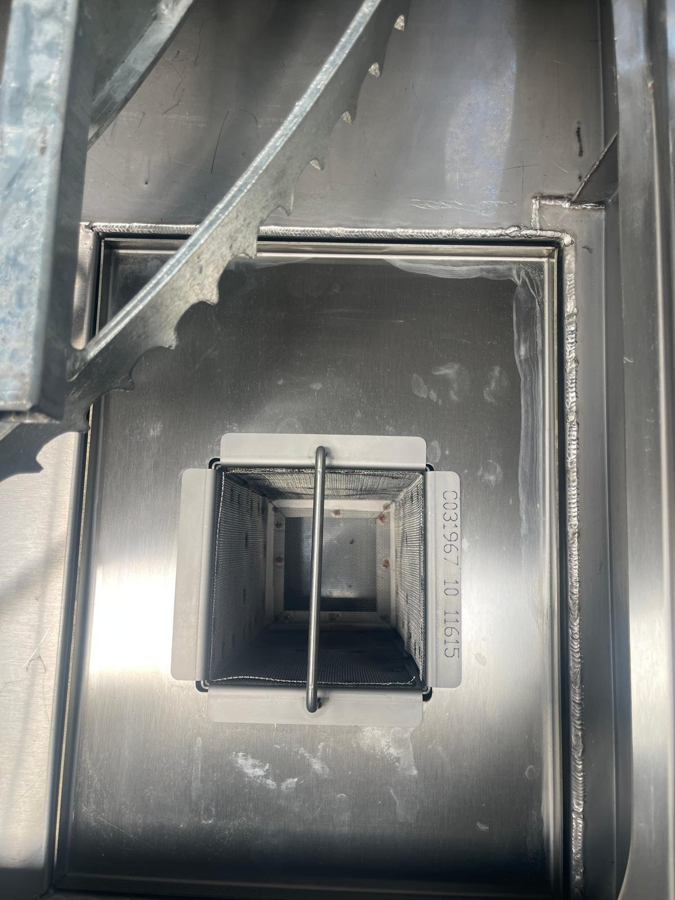
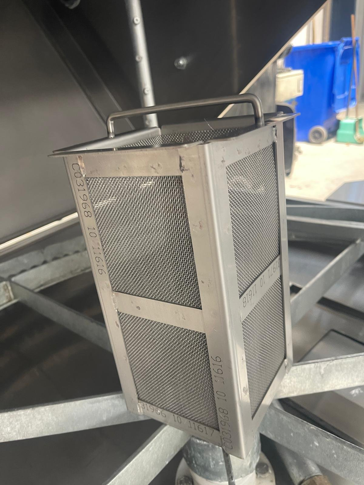
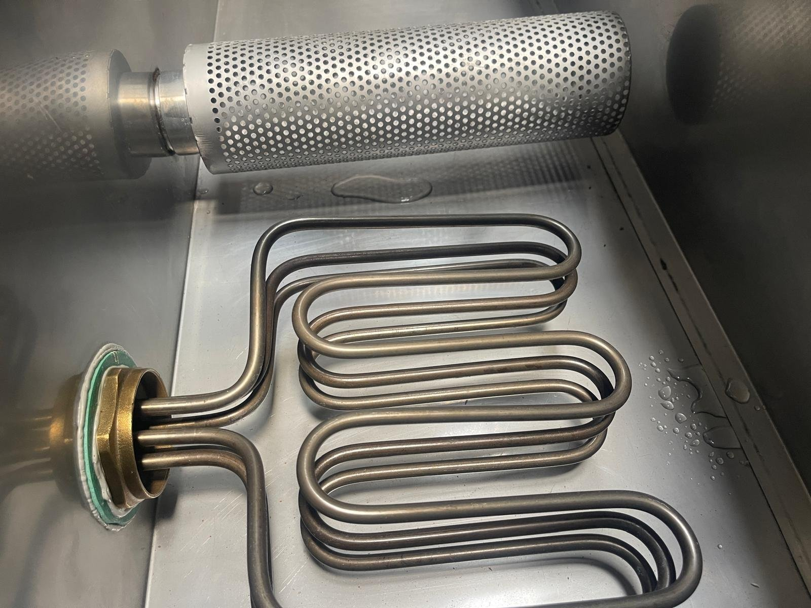
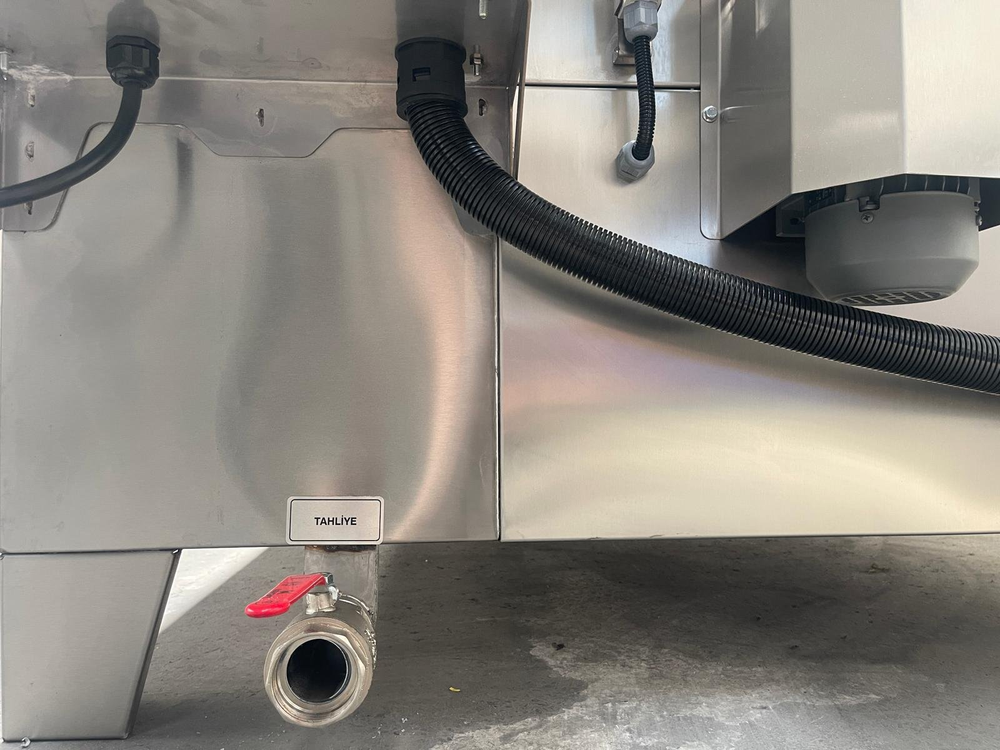

# 10.1 Temizlik ve dezenfeksiyon

## 10.1.1 Temizlik öncesi güvenlik

Her temizlik işleminden önce aşağıdaki adımları uygulayın:

1. Makineyi kırmızı STOP butonu ile durdurun ve sepetin tamamen durmasını bekleyin.
2. Isıtıcı şalterini ve ana şalteri **0** konumuna getirin.
3. LOTO uygulayın (**Bkz. Bölüm 2.4**).
4. Proses suyunun ve hücre yüzeylerinin güvenli sıcaklığa soğumasını bekleyin.

Kapak kapalı switchini veya interlock kilidi temizlik sırasında baypas etmeyin.

**UYARI — Sıcak yüzey ve buhar:** Çalışma sonrasında proses suyu, tank, hücre yüzeyleri ve filtreler sıcaktır; temas yanığa neden olur. Kapağı açmadan önce proses suyunun güvenli sıcaklığa inmesini bekleyin ve ısıya dayanıklı koruyucu eldiven kullanın.

**UYARI — Kimyasal:** Proses suyu yıkama kimyasalı içerir; cilt ve göz ile teması tahrişe neden olabilir. Filtreleri ve tankı temizlerken koruyucu eldiven ve koruyucu gözlük kullanın. Yalnızca **Bölüm 10.1.5**'te belirtilen temizlik maddelerini kullanın.

## 10.1.2 Günlük temizlik — ön filtre

Ön filtre, yıkama hücresinden tanka dönen suyun içindeki kaba kirleri ve parçalardan düşen talaşları tutar. Ön filtre, yıkama hücresi tabanındaki filtre yuvasına yerleştirilmiştir ve kapak açıkken üstten çıkarılır.

*Şekil 10.1 — Hücre tabanındaki ön filtre yuvası (solda) ve yuvadan çıkarılmış ön filtre sepeti (sağda)*

| Parametre | Değer |
| :--- | :--- |
| **Periyot** | Günlük |
| **Yedek parça** | LYM 950: 07 01221 Ön filtre komplesi; LYM 1150 / 1350 / 1500: 07 10214 Ön filtre NS komplesi |

1. Makineyi durdurun ve LOTO uygulayın (**Bkz. Bölüm 10.1.1**).
2. Kapağı açın.
3. Ön filtreyi tutma kolundan kavrayarak yuvasından yukarı doğru çıkarın.
4. Filtre içindeki kaba kirleri ve talaşları bir atık kabına boşaltın.
5. Filtreyi şebeke suyu ve onaylı temizlik maddesi ile temizleyin. Gerekirse yüksek basınçlı su veya fırça kullanın.
6. Filtrede deformasyon, yırtık veya delinme olup olmadığını kontrol edin. Hasarlı filtreyi yedek parça ile değiştirin.
7. Filtre yuvasında kalan kirleri temizleyin.
8. Filtreyi yuvasına doğru yönde, tam oturacak şekilde yerleştirin.
9. Kapağı kapatın ve LOTO'yu kaldırın.

Beklenen sonuç: Ön filtre temizdir ve yuvasına tam oturmuştur; makine çalıştırıldığında pompa emişinde anormal ses oluşmaz.

**DİKKAT — Filtresiz çalışma:** Ön filtre takılmadan çalıştırılan makinede talaş ve kaba kirler doğrudan tanka ve pompa emişine ulaşır; pompa çarkında ve salmastrasında hasar oluşur, nozullar tıkanır. Makineyi ön filtre yuvasında değilken çalıştırmayın.

## 10.1.3 Haftalık temizlik — emiş filtresi, torba filtre ve tank yüzeyi

Emiş filtresi, tank içinde pompa emiş borusunun ucunda bulunan delikli silindirik filtredir ve pompayı tank içindeki partiküllerden korur. Hassas filtre opsiyonu bulunan makinelerde ayrıca pompa çıkış hattında 200 mikron torba filtre bulunur.

*Şekil 10.2 — Tank içindeki emiş filtresi ve ısıtıcı*

| Parametre | Değer |
| :--- | :--- |
| **Periyot** | Haftalık |
| **Emiş filtresi yedek parça** | LYM 950: 07 00800 Emiş filtresi komplesi (PYM 1); LYM 1150 / 1350 / 1500: 07 00670 Emiş filtresi komplesi |
| **Torba filtre yedek parça (hassas filtre opsiyonu)** | 10 05378 Torba filtre 200 mikron |

1. Makineyi durdurun ve LOTO uygulayın (**Bkz. Bölüm 10.1.1**).
2. Günlük ön filtre temizliğini uygulayın (**Bkz. Bölüm 10.1.2**).
3. Emiş filtresine erişmek gerekiyorsa tank suyunu boşaltın (**Bkz. Bölüm 10.1.4**).
4. Emiş filtresini sökün.
5. Emiş filtresini temizleyin; delikleri tıkalı veya filtre gövdesi hasarlıysa filtreyi değiştirin.
6. Hassas filtre bulunan makinelerde, pompa çıkış hattındaki torba filtreyi sökün; temizleyin veya değiştirin.
7. Filtre contalarını ve bağlantılarının sızdırmazlığını kontrol edin.
8. Yağ sıyırıcı bulunan makinelerde, tank yüzeyinde kalan yağ tabakasını temizleyin.
9. Filtreleri yerine takın.
10. Tankı gerekirse yeniden doldurun ve LOTO'yu kaldırın.

Beklenen sonuç: Filtreler temiz veya yenidir; pompa debisi normaldir; bağlantılarda sızıntı yoktur.

Emiş filtresi söküm ve takma ayrıntıları: [EKSİK]

## 10.1.4 Tank boşaltma, temizlik ve dezenfeksiyon

Bu işlem; proses suyunun değiştirilmesi gerektiğinde (**Bkz. Bölüm 7.6.2**), uzun süreli duruştan önce ve tankta koku veya kir birikimi oluştuğunda uygulanır. Tank dezenfeksiyonu sabunlu su ile yapılır.

*Şekil 10.3 — Makinenin ön alt kısmındaki tahliye vanası*

1. Makineyi durdurun ve LOTO uygulayın (**Bkz. Bölüm 10.1.1**).
2. Tahliye vanasının çıkışının atık su toplama noktasına bağlı olduğunu kontrol edin (**Bkz. Bölüm 5.3.3**).
3. Tahliye vanasını açın ve tanktaki proses suyunu tamamen boşaltın. Drenaj pompası bulunan makinelerde tankı drenaj pompası ile boşaltın.
4. Ön filtreyi ve emiş filtresini çıkarın ve temizleyin (**Bkz. Bölüm 10.1.2** ve **10.1.3**).
5. Tank tabanında biriken çamur ve talaşı toplayın.
6. Tank iç yüzeylerini sabunlu su ile yıkayın; paslanmaz çelik yüzeylere uygun yumuşak fırça veya bez kullanın.
7. Sabunlu suyu tahliye hattına boşaltın.
8. Tankı temiz su ile durulayın ve durulama suyunu boşaltın.
9. Yıkama hücresi iç yüzeylerini ve sepeti aynı şekilde temizleyin ve durulayın.
10. Tahliye vanasını kapatın.
11. Tank içini kurumaya bırakın veya kuru bezle kurulayın.
12. Filtreleri yerine takın.
13. Tankı **Bölüm 5.3.2**'ye göre yeniden doldurun ve LOTO'yu kaldırın.

**DİKKAT — Asitli dezenfektan:** Asit bazlı dezenfektan ve temizlik maddeleri paslanmaz çelik yüzeylerde, contalarda ve pompada korozyona neden olur. Tank dezenfeksiyonunda yalnızca sabunlu su kullanın.

## 10.1.5 Temizlik maddeleri

| Uygulama | Önerilen ürün |
| :--- | :--- |
| **Genel temizlik** | VEIDEC 89 SUPER FOAM 750 |
| **Çıkmayan, inatçı lekeler** (az miktarda, ıslatılmış sünger ile ovarak) | VEIDEC BIO CLEANING 3 |
| **Paslanmaz yüzey parlatma** | VEIDEC 34 INOX |
| **Tank dezenfeksiyonu** | Sabunlu su |
| **Makine temizliği için su** | Şebeke suyu |

Eşdeğer ürün kullanılacaksa, ürün asit bazlı olmamalı ve paslanmaz çelik, tank ve conta malzemelerine zarar vermemelidir. Paslanmaz çeliğe uyumlu nötr veya hafif alkali deterjanlar kullanılabilir. Temizlik maddelerini, üreticisinin dozaj, bekleme süresi ve durulama talimatlarına uygun kullanın.

Asit bazlı temizlik maddeleri ve paslanmaz çeliğe zarar veren temizlik maddeleri kullanılmamalıdır.

## 10.1.6 Dış yüzey ve elektrik panosu temizliği

1. Makinenin dış paslanmaz yüzeylerini, gerekirse genel temizlik maddesiyle nemlendirilmiş bez ile silin.
2. Yüzeyleri kuru bez ile kurulayın.
3. Elektrik panosu ön yüzünü, termostat ve zamanlayıcı ekranlarını yalnızca kuru veya hafif nemli bezle silin.

**DİKKAT — Elektrik bileşenlerine su:** Elektrik panosuna, termostat ve zamanlayıcıya, kapak kapalı switchine ve interlock kilit kutusuna su veya temizlik maddesi püskürtmeyin. Panoya giren su kısa devreye, kaçak akım koruma cihazının atmasına ve bileşen arızasına neden olur.

Kurulama tamamlandıktan sonra LOTO'yu kaldırın. Makineyi **Bölüm 7.2**'ye göre devreye alın.

## 10.1.7 Atık su ve kimyasal bertarafı

Tanktan boşaltılan proses suyu, sabunlu yıkama suyu ve filtrelerden toplanan atıklar yağ, kir ve kimyasal içerir. Bu atıklar:

- Doğrudan kanalizasyona, yağmur suyu hattına veya toprağa boşaltılmamalıdır.
- Makinenin kullanıldığı ülkenin atık su ve kimyasal atık mevzuatına uygun olarak toplanmalıdır.
- Tesisin çevre izinleri kapsamında arıtılmalı veya lisanslı atık firmasına teslim edilmelidir.

## 10.1.8 Temizlik kayıt formu

| No | İşlem | Periyot | Tarih | Uygulayan |
| :---: | :--- | :--- | :--- | :--- |
| 1 | Ön filtre temizliği | Günlük | | |
| 2 | Emiş filtresi temizliği veya değişimi | Haftalık | | |
| 3 | Torba filtre temizliği veya değişimi (hassas filtre opsiyonu) | Haftalık | | |
| 4 | Tank boşaltma ve dezenfeksiyon (sabunlu su) | Gerektiğinde | | |
| 5 | Dış yüzeylerin kurulanması | Her temizlik sonrası | | |
