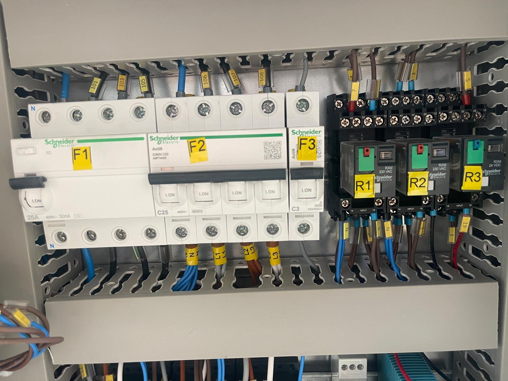

# 11.1 Genel teşhis sırası

## 11.1.1 Arıza bildirimi

Makine, arızaları iki şekilde bildirir:

| Bildirim türü | Kapsam | Teşhis |
| :--- | :--- | :--- |
| **Arıza lambası (pano ön yüzü)** | Düşük su seviyesi, redüktör arızası, pompa arızası | **Bölüm 11.2**, Arıza 1–3 |
| **Lambasız arıza (pano içi termik)** | Kurutma fanı, drenaj pompası, yağ sıyırıcı, buhar tahliye fanı ve diğer opsiyon motorları | **Bölüm 11.2**, Arıza 4 |

Arıza lambası bulunmayan opsiyonel donanımlardaki termik atmaları, yalnızca ilgili donanımın çalışmamasıyla fark edilir. Bu durumda pano içindeki ilgili termik rölenin kontrol edilmesi gerekir.

*Şekil 11.1 — Pano içi koruma elemanları: kaçak akım koruma cihazı ve devre kesiciler (F1–F3) ile röleler (R1–R3)*

## 11.1.2 Teşhis sırası

Bir arıza durumunda aşağıdaki sırayı izleyin:

1. Acil stop butonunun serbest olduğunu ve RESET verildiğini kontrol edin (**Bkz. Bölüm 2.5**).
2. Pano üzerindeki arıza lambalarını okuyun ve yanan lambaya karşılık gelen arızayı **Bölüm 11.2**'de bulun.
3. Bir termik röle attıysa, önce arızanın nedenini giderin; ardından termik röleyi resetleyin ve makineyi tekrar deneyin.
4. Arıza lambası olmayan bir opsiyonel donanım çalışmıyorsa, pano içindeki termik röleyi kontrol ettirin (Arıza 4).
5. Kaçak akım koruma cihazı attıysa, fonksiyonları tek tek devreye alarak arızalı devreyi bulun (Arıza 5).

Termik röle veya kaçak akım koruma cihazını, arızanın nedeni giderilmeden tekrar tekrar resetlemeyin. Neden giderilmeden yapılan her reset; motorda, rezistansta veya kablolarda kalıcı hasar riskini artırır.

## 11.1.3 Servis çağırma kriterleri

Aşağıdaki durumlarda makineyi kullanmayı bırakın ve üreticiye veya yetkili servise başvurun (**Bkz. Bölüm 1.3**):

- Termik röle resetlendikten sonra aynı arıza tekrarlıyorsa,
- Redüktör veya pompa, boşta çalıştırmada dahi aşırı akım çekiyorsa,
- Kaçak akım koruma cihazı, hangi devrede olursa olsun tekrar tekrar atıyorsa,
- Kapak switchinin değiştirilmesi veya kablolama onarımı gerekiyor ve işletmede yetkili bakım personeli bulunmuyorsa,
- Motorda iç hasar veya pompada mekanik hasar şüphesi varsa.

Servise başvururken makinenin modelini, seri numarasını, yanan arıza lambasını, arızanın ne zaman ve hangi işlem sırasında oluştuğunu ve uygulanan teşhis adımlarını bildirin.
